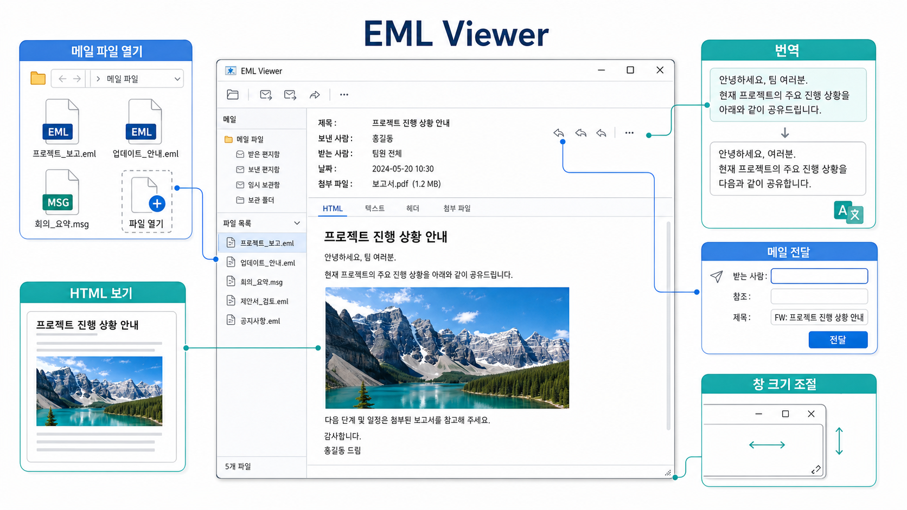

# EML Viewer

[English](README.md) | 한국어

EML Viewer는 Windows에서 `.eml` 및 Outlook `.msg` 이메일 파일을 편하게 열어 보기 위한 데스크톱 앱입니다. 일반 창처럼 다루기 쉽고, HTML 이메일 본문은 Qt WebEngine으로 렌더링해서 표, CSS, 인라인 이미지가 더 안정적으로 보이도록 만드는 것을 목표로 합니다.

## 만든 이유

회사 업무 중 이메일 파일을 읽을 때 기본 이메일 뷰어가 `Win + Left`, `Win + Right` 같은 Windows 창 스냅 단축키와 잘 맞지 않아 불편했습니다. 처음에는 이메일 파일 하나를 안정적으로 열어 보는 작은 뷰어로 시작했고, 개발하면서 기본 이메일 읽기 프로그램보다 편한 기능을 조금씩 추가하는 방향으로 확장하고 있습니다.

이 프로젝트는 공개 저장소로 관리합니다. 따라서 README에는 회사명, 내부 시스템명, 실제 이메일 내용, 기밀 정보가 들어가지 않도록 작성합니다.

## 주요 기능

- 앱에서 `.eml` 또는 `.msg` 파일 열기
- 파일 연결 후 탐색기에서 `.eml` 또는 `.msg` 파일 더블클릭으로 열기
- 제목, 보낸 사람, 받는 사람, 참조, 날짜 표시 및 원클릭 복사 피드백
- Plain Text 본문과 HTML 본문 탭 제공
- Qt WebEngine 기반 HTML 렌더링으로 표, CSS, 인라인 이미지 표시 개선
- `cid:`, `Content-Location`, 상대 이미지 경로, CSS `url(...)`, `srcset` 이미지 참조 처리
- 외부 이미지는 기본 차단하고, 설정에서 자동 표시 여부를 선택할 수 있도록 제어
- 현재 본문을 한국어, 영어, 폴란드어로 번역
- HTML 본문과 인라인 이미지를 유지하면서 원본 메일 파일을 첨부해 전달
- 여러 수신자를 쉼표로 입력하고 최근에 사용한 수신자 조합을 다시 선택
- 첨부파일 목록 표시 및 저장
- 창 크기를 자유롭게 조절하고 마지막 크기와 위치 저장
- GitHub Releases 기반 업데이트 확인
- 오류 발생 시 프로그램 종료 대신 사용자용 오류 메시지 표시

## 빠른 사용 안내



1. 앱에서 `.eml` 또는 `.msg` 파일을 엽니다.
2. HTML 탭에서 인라인 이미지를 포함한 원본 메일 레이아웃을 확인합니다.
3. 번역을 선택하면 원본 파일을 바꾸지 않고 번역된 읽기 화면을 만듭니다.
4. 전달할 때 여러 수신자를 쉼표로 구분해 입력할 수 있으며, 성공한 수신자 조합은 다음 전달 창에서 다시 선택할 수 있습니다.
5. 필요한 크기로 창을 조절하면 다음 실행 때 크기와 위치가 복원됩니다.

## 일반 사용자 설치

Windows 설치 파일은 Python이 없는 사용자도 실행할 수 있도록 만드는 배포 방식입니다.

1. `EmlViewerSetup-<version>.exe` 파일을 내려받아 실행합니다.
2. `.eml` 및 `.msg` 파일 연결 옵션을 사용하려면 기본 체크 상태로 둡니다.
3. 설치 후 시작 메뉴에서 `EML Viewer`를 실행하거나 `.eml` 또는 `.msg` 파일을 더블클릭합니다.

## 개발 환경 준비

```powershell
python -m venv .venv
.\.venv\Scripts\Activate.ps1
python -m pip install --upgrade pip
python -m pip install -e .
```

앱 실행:

```powershell
python -m eml_viewer
```

샘플 파일을 바로 열기:

```powershell
python -m eml_viewer .\samples\example_plain_text.eml
```

테스트 실행:

```powershell
python -m unittest discover -s tests
```

## 빌드

Windows 앱 폴더 빌드:

```powershell
python -m pip install -e ".[build]"
.\scripts\build_windows.ps1
```

결과물은 `dist\EmlViewer`에 생성됩니다.

Windows 설치 파일 빌드:

```powershell
python -m pip install -e ".[build]"
.\scripts\build_installer.ps1
```

설치 파일 빌드에는 Inno Setup 6이 필요합니다. 결과물은 `installer\`에 생성됩니다.

## 설계 메모

- 화면 코드와 이메일 파싱 로직을 분리합니다.
- `EmlParser`는 메일 구조를 해석하고 첨부파일과 인라인 리소스를 분류합니다.
- `MessageBodyWidget`은 HTML 리소스를 준비하고 본문을 표시합니다.
- HTML 렌더링은 패키지 크기보다 본문 재현성을 우선해 Qt WebEngine을 사용합니다.
- 원격 이미지는 추적 픽셀과 개인정보 위험을 줄이기 위해 기본 차단합니다.
- 첨부파일 저장은 미리 보기, 확인, 실행 순서로 처리합니다.

## 개인정보 및 공개 저장소 주의사항

- 실제 이메일 파일, 회사 자료, 내부 URL, 인증 정보, 고객 정보를 커밋하지 않습니다.
- 포함된 샘플은 `example.com` 주소만 사용합니다.
- 릴리스 전에는 추적 파일에 기밀 문자열이나 비밀값이 없는지 확인합니다.

확인에 사용할 수 있는 명령:

```powershell
git grep -n -I -i -E "api[_-]?key|secret|token|password|credential|client_secret|private key|confidential|internal|proprietary" -- .
git grep -n -I -E "[A-Za-z0-9._%+-]+@[A-Za-z0-9.-]+\.[A-Za-z]{2,}|https?://" -- .
```
